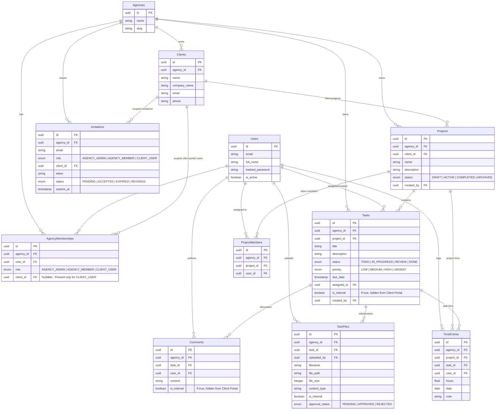

# AgencyDesk — System Architecture & Design Specification

This document details the multi-tenant architecture, database schema, data isolation guarantees, security model, and edge case implementations of **AgencyDesk**.

---

## 📐 Entity-Relationship (ER) Diagram



---

## 🔒 Multi-Tenant Data Isolation Strategy

1. **Header-Based Scope Enforcement**:
   Every incoming HTTP request requires an `X-Agency-ID` header alongside the `Authorization: Bearer <JWT>` token.

2. **Repository Level Query Filtering**:
   All database repositories (`ProjectRepository`, `TaskRepository`, `ClientRepository`, etc.) force-append:
   ```sql
   WHERE agency_id = :current_agency_id
   ```
   Even if a malicious user guesses a valid UUID belonging to another agency, the query evaluates to zero rows.

3. **Global User Identity vs. Local Agency Membership**:
   - `User` table holds universal authentication credentials.
   - `AgencyMembership` binds a `User` to a specific `Agency` with a designated `role` and optional `client_id`.
   - This architecture enables a single email address to hold membership across multiple independent agencies (e.g. Admin in Agency A, Client User in Agency B) with complete role separation.

---

## 🛡️ Role-Based Access Control (RBAC) & Visibility Matrix

| Feature / Resource | Agency Admin | Agency Member | Client User |
| :--- | :--- | :--- | :--- |
| **Manage Agency Settings & Users** | ✅ Full Access | ❌ Denied | ❌ Denied |
| **Create & Delete Clients** | ✅ Full Access | ❌ Denied | ❌ Denied |
| **Create & Edit Projects** | ✅ Full Access | ✅ Assigned Projects | ❌ Denied (Read-only owned projects) |
| **Create & Edit Tasks** | ✅ Full Access | ✅ Full Access | ❌ Denied (Read-only owned tasks) |
| **Internal Content (`is_internal = True`)** | ✅ Visible | ✅ Visible | 🔒 **Strictly Hidden** |
| **Comment & File Attachments** | ✅ Full Access | ✅ Full Access | ✅ Allowed on owned public tasks |
| **Approve Files** | ✅ Full Access | ✅ Full Access | ✅ Allowed on client attachments |
| **Time Entry Logging** | ✅ Full Access | ✅ Full Access | ❌ Denied |

---

## 🚀 Key Edge Cases Handled

1. **Cross-Tenant Access Prevention**:
   Strict `agency_id` scoping ensures zero cross-agency data exposure.

2. **Internal Content Filtering**:
   Tasks, Comments, and TaskFiles with `is_internal = True` are filtered out at the Service/Repository layer when requested by a `CLIENT_USER`.

3. **Multi-Agency User Identity**:
   A user can belong to multiple agencies without token collision; switching active agency updates `X-Agency-ID`.

4. **Idempotent Invitation Flow**:
   Re-inviting an email updates existing pending tokens rather than generating duplicate database entries.

5. **Safe Member Removal**:
   Revoking an agency membership automatically unassigns active task references while retaining audit log history.
